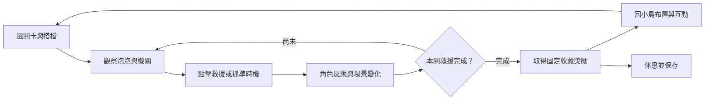

# 星光救援隊：霓虹泡泡樂園｜遊戲設計企劃

版本：提案 v1.0｜2026-09-16  
目標：讓孩子能自己開始、玩出成果，並因為喜歡角色和互動而想再玩。

## 1. 設計決策

**主方向：保留科幻霓虹與雷射主題，改為可直接點擊發射的 3D 泡泡救援遊戲，加上能自由布置的太空小島。**

已確認偏好：保留主題，重整玩法與視覺。保留原作的星空、青紫霓虹、未來工具與命中回饋；將深黑競技場改成明亮的太空遊樂園。第一人稱移動、照片敵人與一次清完 15 個目標屬於可重設的玩法和呈現方式。

孩子不是執行「清除目標」的任務，而是在幫一群古怪的小夥伴回家。每次成功都有角色反應，每關有一個新玩法，每次回小島都能使用剛得到的成果。

主要對象暫定 6–9 歲；尚未確認實際玩家年齡。初期優先支援手機、平板與桌機滑鼠，鍵盤可完成選取與救援。4–5 歲可由陪同者協助試玩，但不先承諾獨立操作；10 歲以上的挑戰需求待驗證後另開設計。

| 決策 | 原因 | 代價 |
| --- | --- | --- |
| 固定斜前方鏡頭，直接點擊目標 | 第一個動作即可產生結果，不需同時學移動與轉視角 | 放棄第一人稱自由探索作為主模式 |
| 一關約 1–3 分鐘，教學約 60–90 秒 | 每段都有可理解的目標與自然結束點 | 需要安排節奏，不能只增加目標數量 |
| 角色被救出後留在小島 | 讓過關成果可被看見與再次互動 | 需製作角色反應與簡單保存 |
| 基礎通關不計時、不扣命 | 未命中仍能繼續嘗試 | 熟練玩家需靠選用挑戰得到變化 |
| 先驗證一關，再做完整三關 | 優先驗證點擊本身是否有趣 | 第一階段不會具備完整內容量 |

這是待測試的設計假設，不能僅憑企劃保證孩子喜歡。

## 2. 現況診斷

以下為原始碼可確認的現況；對吸引力的影響為設計判斷，尚未以使用者測試證實。

| 原始碼觀察 | 可能影響 | 重設計對應 |
| --- | --- | --- |
| `src/App.jsx` 固定 15 個目標，全部移除即勝利 | 只有總數推進，過程缺少新事件 | 分成短波次，每關加入一種變化 |
| `src/Player.jsx` 為第一人稱移動、跳躍；手機另需拖曳視角與射擊 | 第一次玩可能忙於控制而非享受玩法 | 直接點泡泡，預設無移動與旋轉要求 |
| `src/Level.jsx` 目標使用同一張照片貼在旋轉方塊上 | 角色辨識、個性與動作變化有限 | 三隻輪廓不同、反應不同的小怪獸 |
| 命中後從陣列移除並播放音效 | 玩家可能只看到消失，缺少救援過程 | 泡泡變形、破裂、怪獸落地、向玩家致意 |
| 勝利頁顯示英文標題和圖片，未見重玩按鈕 | 完成後缺少明確下一步 | 下一關、回小島、再玩一次 |
| 黑底、霓虹格線、星空與 Bloom | 目前呈現較偏科幻射擊，需驗證兒童偏好 | 保留星空和青紫光條，改成明亮太空玩具島與清楚前景 |
| 未見關卡解鎖、收藏保存、暫停與音量設定 | 成果無法延續，也不方便中途停下 | 本機存檔、暫停、音效與音樂分開調整 |

可沿用：React、R3F、Three.js、Zustand，以及即時命中、音效和觸控處理的經驗。主玩法不依賴玩家物理移動，因此不必為沿用舊程式保留跳躍與雙搖桿負擔。

## 3. 孩子為什麼會想玩

| 動機假設 | 具體設計 | 如何驗證 |
| --- | --- | --- |
| 「我會玩！」 | 第一顆泡泡大、靜止、點一下就成功 | 不經成人指導能否在 15 秒內成功 |
| 「牠好好笑！」 | 小怪獸以噴嚏、翻滾、害羞躲藏回應救援 | 是否主動注意、模仿、命名或再次互動 |
| 「我想試別的方法。」 | 玩家選擇先點連鎖泡泡或等待風車停下 | 重玩時是否改變順序或嘗試不同時機 |
| 「這是我的島。」 | 選怪獸搭檔、擺裝飾、讓角色表演 | 是否能做選擇並辨認自己的布置 |
| 「下一區有什麼？」 | 地圖用新環境和未救出的角色剪影預告 | 是否自主選擇看下一關 |

設計取向參考 UNICEF RITEC 對自主選擇、能力感、創造與關係的討論。這些是設計參考，不是本遊戲成效的證明；泡泡、怪獸、小島與下列數值皆為本案提案。[UNICEF RITEC Design Toolbox](https://www.unicef.org/childrightsandbusiness/workstreams/responsible-technology/online-gaming/ritec-design-toolbox)

## 4. 世界與角色

太空樂園的能量泡泡機打了個大噴嚏，把小怪獸和玩具包進霓虹泡泡，飄到各個太空島。玩家成為星光救援隊員，拿著玩具造型的雷射泡泡棒，點選目標發射短光束，解除泡泡並幫夥伴回家。

原作「魔化分身」改為泡泡機故障產生的能量幻影：破開外殼後散成星光，不出現痛苦反應。具名角色是待救援夥伴；背景保留星空、發光格線平台和青紫色科技裝飾，小島是漂浮於太空中的個人基地。

開場只需要一句話：「小夥伴被泡泡帶走了，點一下，幫牠回家！」故事透過畫面呈現，避免先讀多頁說明。

| 角色 | 外形與個性 | 救援回饋 | 回島互動 |
| --- | --- | --- | --- |
| 啵啵 | 圓滾黃色小恐龍，喜歡打噴嚏 | 打出一個小泡泡，把自己嚇一跳 | 點牠會吹泡泡，泡泡可再被點破 |
| 糖糖 | 長耳粉紅小怪獸，愛跳舞 | 落地轉圈，耳朵打結後鬆開 | 與音符花互動跳舞 |
| 咚咚 | 方圓薄荷綠小怪獸，慢半拍 | 抱著泡泡殼翻滾，再向玩家揮手 | 坐上蹺蹺板後輕輕彈起 |

三隻角色皆以幾何形狀和程式動畫製作首版，配上透明太空頭盔、星形徽章或發光小背包以延續科幻主題，不以昂貴模型作為驗證前提。角色個性不提供數值強弱，孩子能自由選最喜歡的搭檔。

原本照片素材不再放在受攻擊目標上；如後續仍想保留個人化，可再評估成為本機小島相框。首版採虛構角色，不新增照片上傳流程。

## 5. 核心遊戲循環



### 每一個點擊都要有回應

- 發射：點選位置出現一段由畫面下方雷射泡泡棒射出的短光束；不要求另外按射擊鍵。命中邏輯即時完成，光束只做演出，避免等待彈道影響觸控感受。
- 命中：泡泡先壓扁，再破成小水珠與星光；怪獸保持完整並開心回應。
- 點空：出現短暫小水圈，不扣分；連續點空才提供視覺引導。
- 點到關閉的機關：機關輕搖，提示圖示顯示「等一下再點」，不造成傷害。
- 成功連鎖：泡泡按順序「啵、啵、啵」破開，固定一小串，避免整個畫面同時爆開。
- 點 UI：只執行 UI 動作，不能同時觸發場景救援。

### 基礎規則與初始調整值

| 項目 | 初始提案 |
| --- | --- |
| 通關 | 完成本關所有必救目標；不依賴挑戰徽章 |
| 生命與彈藥 | 無扣命、無彈藥限制 |
| 首關同屏目標 | 1–3 顆；後續最多 5 顆可互動泡泡 |
| 目標視覺尺寸 | 最短螢幕邊約 12–18%；以實機遮擋情況調整 |
| 觸控區 | 互動目標至少 48 CSS px，主要按鈕至少 56 CSS px；這是本案目標值 |
| 命中回應 | 目標在 100ms 內開始反應；完整救援演出約 0.6–1.0 秒 |
| 連續誤觸輔助 | 連續 3 次未命中，下一顆高亮並放慢；一次成功後維持至該波結束 |
| 停滯輔助 | 8 秒沒有成功操作，出現手指示範；再 8 秒可按「幫幫我」 |
| 恢復難度 | 僅在下一波回到原設定，不突然加速正在操作的目標 |

命中優先使用可見目標的螢幕空間點選範圍。若擴大範圍重疊，選與點擊位置最近的可見目標；已救援目標不可重複計數。場景遮蔽物必須影響可點性，不能穿過關閉機關命中。

### 首次遊玩的前 90 秒

| 時段 | 孩子看到與做的事 | 要驗證的感受 |
| --- | --- | --- |
| 0–10 秒 | 啵啵被泡泡托住，首頁只有「開始救援」主按鈕 | 知道要開始做什麼 |
| 10–20 秒 | 大泡泡出現在中央，圖示手指示範點一下 | 第一次成功不用讀說明 |
| 20–35 秒 | 啵啵落地打噴嚏，吹出兩顆新泡泡 | 成功回饋值得看 |
| 35–60 秒 | 自己點三顆慢速泡泡，其中一顆帶動一串小泡泡 | 開始預期自己的操作結果 |
| 60–75 秒 | 最後一顆送回小風車，簡短過關演出 | 有完成一件事的感覺 |
| 75–90 秒 | 把小風車放到島上，啵啵跑來吹它 | 獎勵能被使用，有下一次期待 |

時間為內容節奏目標，不是倒數限制。孩子需要更多時間時，教學持續等待。

## 6. 三關首版內容

每關只新增一種主要規則。怪獸解鎖屬於固定劇情救援；其他泡泡可載小星星或玩具，避免畫面出現一群同名怪獸卻只收藏一隻的混淆。

| 關卡 | 節奏與目標 | 新規則 | 首次完成獎勵 |
| --- | --- | --- | --- |
| 1. 星光草地站 | 教學約 60–90 秒；3 波，1／3／2 顆，共 6 顆 | 點擊發射；末波示範小型連鎖 | 啵啵、小風車、軟墊 |
| 2. 霓虹風車站 | 約 90–150 秒；3 波，3／4／3 顆，共 10 顆 | 能量葉片每循環停下，開口時可救援 | 糖糖、音符花、蘑菇椅 |
| 3. 彩虹太空派對 | 約 120–180 秒；3 波，4／4／4 顆，共 12 顆 | 彩虹泡泡連鎖救出鄰近目標 | 咚咚、彩虹拱門、蹺蹺板 |

### 第 2 關：風車規則

第一波先示範一顆：葉片慢轉約 2 秒、停下約 3 秒。停下時開口帶有張開圖示；玩家點到開口內的泡泡才成功。其他普通泡泡持續可玩，等待不應讓整關停擺。

輔助觸發後，下一次停下延長為約 5 秒。裝飾背景不遮擋必救目標；每顆目標至少有一段完整可點的機會。

### 第 3 關：連鎖規則

彩虹泡泡有星形標記；點它會依固定連結釋放最多 3 顆泡泡。先點普通泡泡也能通關，玩家可探索不同順序。連鎖不要求快速連點，也不因等待而失效。

### 自選挑戰

完成關卡後開放「再試一個小挑戰」，但仍可選普通重玩。每關最多一個額外挑戰徽章：首關找到藏在場景裡的睡覺蝸牛、第 2 關在三次開口期間各成功救援一次、第 3 關完成一次三顆連鎖。

徽章只作個人成就展示，不解鎖必要關卡、角色或裝飾。未達成顯示「下次可以再試試」，不播放失敗演出。

## 7. 收藏、小島與重玩

首版內容總量：3 關、3 隻角色、6 件裝飾、3 個選用挑戰徽章。

- 關卡依 1 → 2 → 3 解鎖；完成一次即可前往下一關。
- 首次完成即獲得該關固定角色與兩件裝飾，不使用隨機抽取。
- 小島提供六個擺放格，點裝飾再點格子即可放置；占用格可交換，物品可收回。
- 三隻角色各有自己的休息點，不占裝飾格；可自由選一隻當下一關搭檔。
- 收藏頁顯示未解鎖物的剪影及取得關卡，讓期待具體可理解。
- 重玩提供熟悉動作、挑戰徽章及不同擺法；固定獎勵不重複發放。
- 可點擊角色觸發短表演。角色與裝飾只先做表格中指定的三組互動，不承諾任意組合都有特殊動畫。
- 第三關完成後呈現全員派對與「自由玩／回小島／休息」，形成完整結尾。

首版不設每日簽到、體力、限時稀有物或連續登入。長期內容是否值得擴充，取決於孩子是否喜歡核心玩法；不以增加收藏數量代替改善遊戲。

## 8. 視覺、音效與介面

### 美術方向

關鍵詞：太空玩具、圓潤、清楚、會動的表情。使用明亮的太空小島、淡色星雲背景與少量高彩度互動物；保留青色與紫色霓虹作平台邊緣、工具和機關提示，讓孩子一眼知道哪裡可以點。

| 用途 | 初始色彩 | 形狀提示 |
| --- | --- | --- |
| 背景星雲 | `#DDF5FF` | 低對比星雲與大行星 |
| 草地與平台 | `#BCE7B4` | 帶科技底座的圓角浮島 |
| 科技裝飾 | `#49DCEB`、`#A78BFA` | 局部發光邊條與稀疏格線 |
| 主按鈕 | `#FFD166` 搭深色文字 | 大圓角矩形、播放三角形 |
| 可點泡泡 | 淡藍透明外殼、明確邊緣 | 圓形輪廓與角色 |
| 連鎖泡泡 | 彩虹裝飾 | 星形標記，不只靠顏色 |
| 一般文字 | `#243447` | 短句、足夠字級 |

色票為提案，實作時需在實際背景上驗證可讀性。減少全畫面 Bloom，不用鏡頭震動作為必要回饋；柔和模式縮短粒子演出並減少快速位移。

### 音效

發射保留輕快電子「咻」聲，命中接柔和短促的「啵」聲；成功連鎖略升音高，但限制同時播放數。角色以無語意短聲加表情傳達心情，首版不必配完整語音。音樂使用輕快太空電子風格，避免音量壓過操作回饋。音樂與音效可分別靜音；所有任務提示也有圖像，靜音仍可完成。

### 必要畫面與文案

| 畫面 | 主要內容 | 動作 |
| --- | --- | --- |
| 首頁 | 小島與角色演出、遊戲名 | 「開始救援」「我的小島」、設定 |
| 選關 | 三個大島圖示、收藏預告 | 點已解鎖關卡；未解鎖圖示提示上一關 |
| 遊戲 | 救援圖示與進度、場景、暫停 | 點泡泡；不常駐大段操作文字 |
| 暫停 | 清楚的遮罩與停止場景 | 「繼續」「重玩這關」「回小島」 |
| 結算 | 救出的角色、固定獎勵、簡短慶祝 | 「下一關」「回小島」「再玩一次」 |
| 小島 | 三隻角色、六個擺放格、收藏抽屜 | 選取、放置、收回、與角色互動 |
| 設定 | 音樂、音效、柔和模式 | 立即套用，返回原畫面 |

手機直向將目標集中在中間區域，頂部為進度與暫停，底部保留提示空間；橫向平板與桌機擴展背景，但不把目標間距同步拉大。旋轉螢幕時暫停並重新布局，避免目標被裁切。

```text
┌─────────────────────────────┐
│ [怪獸圖示] 已救 2／6      [暫停] │
│                             │
│        ○ [泡泡與怪獸]        │
│    ○               ☆        │
│         可互動場景           │
│                             │
│     [必要時：點一下泡泡]      │
└─────────────────────────────┘
```

### 控制與中斷

手機／平板點擊、桌機滑鼠點擊是主輸入。另提供鍵盤選取目前可互動目標與 Enter／Space 觸發，Esc 暫停；焦點必須可見。指標離開、觸控取消、視窗失焦時清理輸入，不產生持續觸發。

暫停凍結機關、目標與音樂進度。回小島保存已取得收藏，放棄本次未完成關卡；離開前用一句話提示。重開網頁保留收藏與已通關紀錄，未完成關卡從頭開始。

## 9. 範圍與成功定義

首版包含三關、三角色、六裝飾、基本設定、本機存檔及完整開始到結束流程。多人連線、帳號、排行榜、商城、自由走動的大世界與關卡編輯器列為首版之外，避免分散核心體驗開發。

最優先回答三件事：孩子能否自己玩懂、是否喜歡每次操作的結果、在沒有催促下是否想再玩。具體門檻與記錄方式見[試玩計畫](./03-playtest-plan.md)。

若固定視角雖好上手但很快無聊，先增加「等時機／選順序」的實質變化；若角色不吸引人，先調整個性和動作。只有試玩顯示孩子主動想走動探索，才把自由移動列入下一輪原型。
